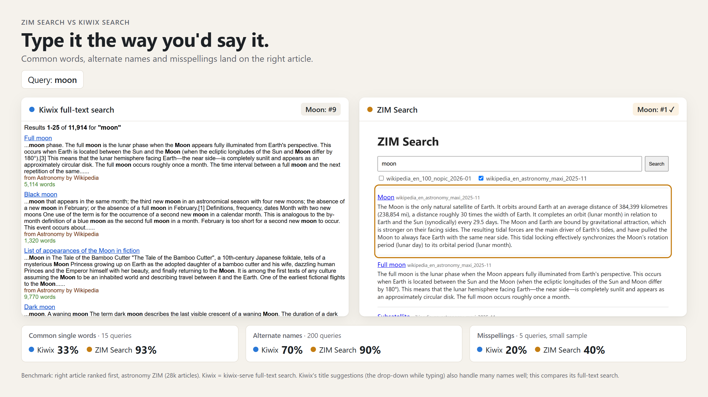

# zimsearch
A search engine that extends Kiwix search by introducing semantic similarity search.

This allows multiple new features, such as:
- Multilingual search (100+ languages)
- Searching several ZIM collections at once
- Answering questions
- Understanding descriptions, alternative names & misspellings
- Higher accuracy on exact page titles
- Improved rankings

Additional features include:
- Collapsing redirects
- Wiki HTML page structure awareness

Compatible with low-powered devices:
- Raspberry Pi Zero 2 W (512 MB RAM)
- ~250–300 MB RAM while serving

# How it works

### 1. Indexing a ZIM (`build`, once per ZIM)

**What gets read.** Every entry in the ZIM is visited once. Images, stylesheets and scripts are skipped.
Redirects (alternate names like "Earths moon" → *Moon*), including the small "forwarding" pages some
ZIMs use instead of real redirects, are stored as **title-only** entries that point to their article.
Thus, searching "USA" still finds the United States page.

**Why the first paragraph.** For each article, zimsearch keeps the title plus the **first paragraph**.
Wikipedia's writing guidelines require an article's opening paragraph to summarize the whole article, so it's the
most compact description of what the article is about. That makes it the best text to compare with
questions and descriptions: in the benchmark, describing an article in the words of its first sentence found it first 80% of the time.
To get a clean paragraph, zimsearch uses Wikipedia's page structure:
- it takes the first `<p>` with at least 50 characters, so pages that open with a one-liner like
  "Mercury may refer to:" (disambiguation pages, lists) are stored as title-only;
- it skips stylesheets, scripts and footnote markers like `[1]` inside the paragraph;
- it keeps at most 1,000 characters.

**Other ZIMs** (Stack Exchange, Gutenberg, TED, …) aren't refused: `build` runs on any ZIM and applies the same
first-paragraph rule to every HTML page. But nothing has been tuned or tested for them, so results depend on how
each site lays out its pages. PDFs inside a ZIM are skipped.

**Embedding.** The title and first paragraph are turned into a vector (a list of 384 numbers describing their meaning) by
[multilingual-e5-small](https://huggingface.co/intfloat/multilingual-e5-small) (int8 ONNX, ~118 MB).
Input is capped at 256 tokens. On the astronomy ZIM, the median article uses 99 tokens, 90% use under 170, and only
0.5% are long enough to be cut.

**Storage.** Each ZIM gets two files in `index_dir`:
- `<name>.sqlite`: titles, first paragraphs, paths, redirect targets, and a full-text index of the titles (SQLite FTS5).
- `<name>.faiss`: the vectors, in one of two layouts depending on size:

| ZIM size | Vector index | Why |
|---|---|---|
| Under 10,000 articles | **Flat**: the query is compared with every vector | Exact, and small enough (a few MB) that comparing everything is fast |
| 10,000 articles or more | **IVF + 8-bit (SQ8)**: vectors are grouped into 4·√n clusters, and each search only scans the closest `nprobe` clusters (64 by default) | Comparing millions of vectors per search is too slow on a Pi. On the 28k-article astronomy ZIM, scanning 64 of 672 clusters (~10%) was about as accurate as scanning everything. 8-bit numbers were nearly exact; heavier compression (PQ48) lost ~25% of the top hits. |

The `.faiss` file is memory-mapped: the operating system reads only the clusters a search touches instead of loading
the whole index into RAM.

If a build stops, running it again resumes from the last saved batch.

### 2. Starting the server (`serve`, once)

At startup zimsearch loads the embedding model (~1.8 s on a laptop) and opens every finished index: the SQLite file
(read-only), the FAISS file (memory-mapped), and the ZIM with its built-in full-text index (~0.4 s for two ZIMs).
These stay open for as long as the server runs; **nothing is reloaded per search**.

A lightweight HTML page is served through FastAPI and is accessible from any browser at `http://<host>:8090`
(the `port` in `config.yaml`).

### 3. Each search (~110 ms on a laptop, two ZIMs)

1. **Embed the query** with the same model (~5 ms).
2. **Run three searches** in every selected ZIM, each finding the best matches in a different way:

   | Search | Finds | Good at | Time |
   |---|---|---|---|
   | **Meaning** (FAISS) | Articles whose first-paragraph vector is closest to the query (cosine similarity) | Questions, descriptions, other languages | ~5 ms |
   | **Title words** (SQLite FTS5, BM25 ranking) | Titles containing every word of the query, including redirect titles | Exact titles, alternate names | ~2 ms |
   | **Full text** (the ZIM's own Kiwix index) | Articles containing the words anywhere | Words buried deep inside an article | ~5 ms |

   Each search fetches twice as many results as will be shown, because redirects collapse several hits into one article.
3. **Collapse redirects**: every hit on a redirect is replaced by its article, and duplicates are merged.
4. **Merge the three lists with Reciprocal Rank Fusion (RRF).** Their scores can't be compared
   (a cosine similarity, a BM25 score, a position in Kiwix's list), so RRF ignores scores and uses positions only:
   an article earns `1 / (60 + its position)` from each list it appears in. An article found near the top
   by several searches beats one that's first in just one, and nothing needs tuning.

Timings were measured on a laptop; a Raspberry Pi is slower.

## Compared with Kiwix search





*Measured on the Wikipedia astronomy ZIM (28k articles), against kiwix-serve's full-text search.*

### Results by type of search

**#1** = the right article is the first result. **Top 5** = it's somewhere in the first five.
"Not in top 20" = it didn't appear in the first 20 results.

| Type of search | Example query → article wanted | Kiwix | ZIM Search | #1 Kiwix → ZIM Search | Top 5 Kiwix → ZIM Search | Queries |
|---|---|---|---|---|---|---|
| Common single words | "moon" → *Moon* | #9 | **#1** | 33% → **93%** | 80% → **93%** | 15 |
| Exact titles | "Jupiter" → *Jupiter* | #2 | **#1** | 58% → **83%** | **100%** → 83% | 12 |
| Alternate names | "Cosmic rays" → *Cosmic ray* | #2 | **#1** | 70% → **90%** | 80% → **98%** | 200¹ |
| Misspellings | "andromeda galaxie" → *Andromeda Galaxy* | #3 | **#1** | 20% → **40%** | 40% → **60%** | 5² |
| First-sentence descriptions | "is a blue supergiant star in the constellation of Major." → *Eta Canis Majoris* | #4 | **#1** | 66% → **80%** | 80% → **89%** | 200¹ |
| Describing it without the name | "device that automatically keeps a telescope locked onto the target it is observing" → *Autoguider* | not in top 20 | **#1** | 21% → **54%** | 29% → **74%** | 100 |
| Questions | "comet that comes back every 76 years" → *Halley's Comet* | #4 | **#1** | 0% → **31%** | 25% → **69%** | 16 |
| Questions & phrases in other languages³ | "¿por qué la luna tiene fases?" (Spanish) → *Lunar phase* | not in top 20 | **#1** | 0% → **7%** | 0% → **20%** | 15 |
| Words deep inside an article | "In 1998, was awarded the Swiss Marcel Benoist Prize…" → *Michel Mayor* | **#1** | #2 | **53%** → 15% | **65%** → 58% | 200¹ |

¹ Generated automatically from the articles, not typed by real users.
² Small sample: treat as a direction, not a precise number.
³ Spanish, French, German, Chinese, Arabic, Hindi, Swahili, Russian, Japanese and Portuguese, mixed.

### Single words in other languages

The English articles searched with one word in another language (for example "moon" in that language), 15 words per language.

| Language | Example query → article wanted | Kiwix | ZIM Search | #1 Kiwix → ZIM Search | Top 5 Kiwix → ZIM Search |
|---|---|---|---|---|---|
| English | "sun" → *Sun* | #2 | **#1** | 33% → **93%** | 80% → **93%** |
| French | "télescope" → *Telescope* | #4 | **#1** | 20% → **33%** | 33% → **47%** |
| Portuguese | "sol" → *Sun* | not in top 20 | **#3** | 7% → **27%** | 27% → **67%** |
| Arabic | "الشمس" → *Sun* | not in top 20 | **#1** | 0% → **20%** | 0% → **33%** |
| Afrikaans | "planeet" → *Planet* | not in top 20 | **#1** | 0% → **13%** | 7% → **33%** |
| Amharic | "ፀሐይ" → *Sun* | not in top 20 | **#1** | 0% → **13%** | 0% → **20%** |
| Swahili | "mwezi" → *Moon* | not in top 20 | **#6** | 0% → **13%** | 7% → 13% |
| Somali | | | | 0% → **7%** | 7% → 7% |
| Hausa, Yoruba, Igbo, Zulu, Kinyarwanda | | | | 0% → 0% | 0% → 0% |

**Where Kiwix is still better, or cheaper:**
- **Words buried deep inside an article.** Kiwix indexes every word thus performs better on deeper searches(53% first vs 15%). While zimsearch only indexes each article's title and first paragraph.
- **No setup.** Kiwix search works the moment a ZIM is added. zimsearch must index each ZIM
  first. (Very large ZIMs may require hours) 
- **Smaller footprint.** zimsearch adds a `.sqlite` and `.faiss` per ZIM and needs more RAM.

## Requirements
- Python 3.10 or newer
- Wikipedia-style ZIM files (zimsearch relies on their predictable HTML structure to find the first paragraph)
- *Searching does not require Kiwix.* To open the articles from the result links, run
  [kiwix-serve](https://kiwix.org/en/applications/) with the same ZIMs (set its address as `kiwix_url` in `config.yaml`).

## Install

1. **Get the code** and enter the folder (run every command from here; `config.yaml` is read from this folder):

   ```bash
   git clone <this repository's URL> zimsearch
   cd zimsearch
   ```

2. **Create a virtual environment and install the dependencies:**

   ```bash
   python3 -m venv .venv
   . .venv/bin/activate              # Windows: .venv\Scripts\activate
   pip install -r requirements.txt
   ```

3. **Download the model** into a folder of your choice (keep these file names):

   ```bash
   mkdir -p ~/zimsearch-model && cd ~/zimsearch-model
   wget -O model.onnx https://huggingface.co/Xenova/multilingual-e5-small/resolve/main/onnx/model_quantized.onnx
   wget https://huggingface.co/intfloat/multilingual-e5-small/resolve/main/sentencepiece.bpe.model
   cd -
   ```

   Without `wget` (e.g. Windows): `curl -L -o model.onnx <url>` and `curl -L -O <url>` work the same way.

4. **Get ZIM files.** Put them in one folder. Download them from [library.kiwix.org](https://library.kiwix.org)
   or [download.kiwix.org/zim](https://download.kiwix.org/zim/).

5. **Edit `config.yaml`** (every setting is explained there). At minimum, set:
   - `zim_dir`: the folder with your `.zim` files
   - `index_dir`: where the indexes will be written (created automatically)
   - `model_dir`: the folder from step 3
   - `kiwix_url`: where kiwix-serve shows articles, so result links open

6. **Check that it runs:**

   ```bash
   python -m zimsearch --help
   ```

## Use

```bash
python -m zimsearch build wikipedia_en_all            # index ZIMs in zim_dir by name (one or more)
python -m zimsearch build --path /some/where/x.zim   # or index one ZIM file by its path
python -m zimsearch serve                            # web page on http://<host>:8090
```

If a build stops, run it again and it will automatically pick up where it left off.

To rebuild a ZIM, delete its `.sqlite` and `.faiss` from `index_dir` first.
Restart `serve` after building a new index so it picks it up.

Each ZIM gets two files in `index_dir`: `<name>.sqlite` (titles, first paragraphs) and
`<name>.faiss` (vectors). Indexing all of Wikipedia takes days on a Pi, so you can build
on a PC and copy both files over.

JSON API Example: `GET /api/search?q=...&zim=<name>&zim=<name2>&limit=20` (no `zim` = all) and `GET /api/zims`.
