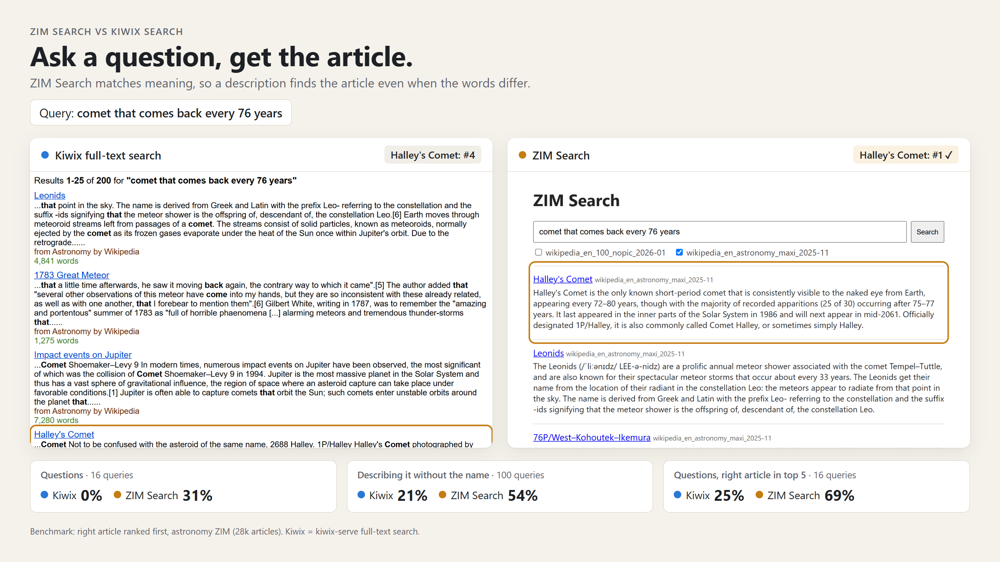
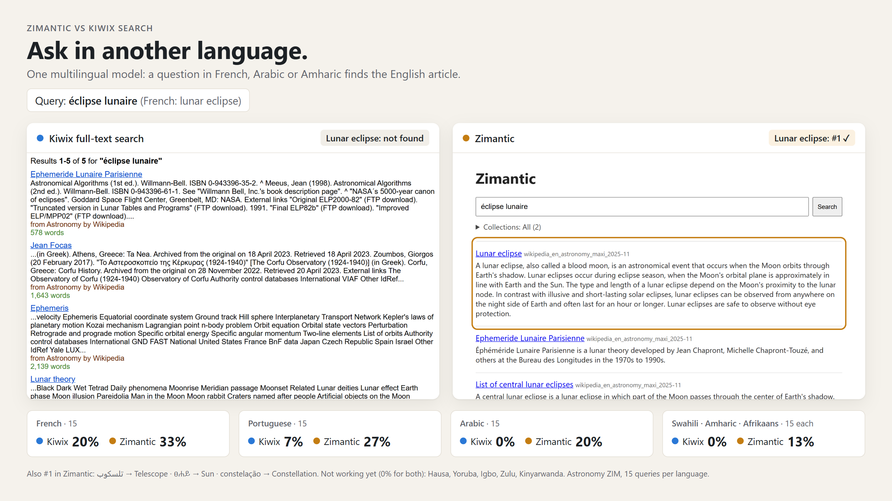
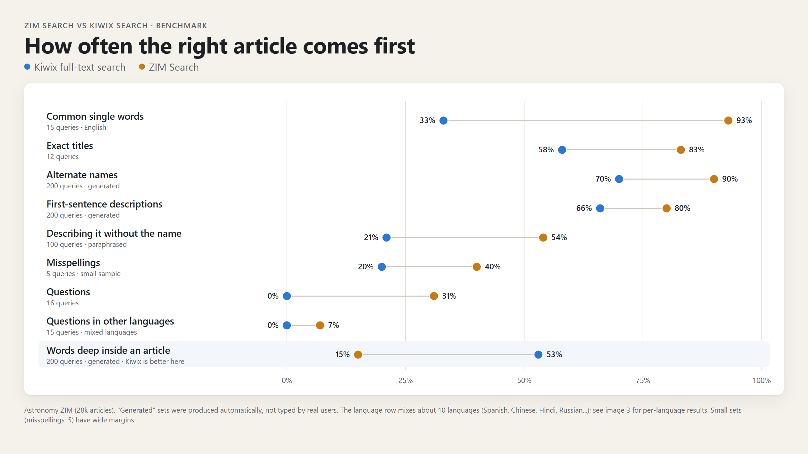

# Zimantic

**Offline search that understands what you mean, for Kiwix ZIM files.**

Zimantic adds meaning based searching on ZIM files; the compressed offline copies of Wikipedia and other websites which are published by Kiwix.  

Ask a question, describe something without knowing its name, misspell it, or search in one of 100+ languages, and Zimantic looks for the article closest to what you mean. It works best in widely spoken languages. Everything runs offline, on low resource hardware as small
as a Raspberry Pi Zero 2 W.

| You type | Kiwix search | Zimantic |
|---|---|---|
| "what causes lockjaw" | *Tetanus* not in the top 20 | *Tetanus* at **#1** |
| "diabetis" (misspelled) | *Diabetes* not in the top 20 | *Diabetes* at **#1** |
| "糖尿病" (Chinese for "diabetes") | *Diabetes* not in the top 20 | *Diabetes* at **#1** |

*Searched in WikiMed, the Wikipedia medical encyclopedia ZIM. Results below.*

## Features

- **Search by meaning**: questions and descriptions find articles even when they share no words with the title.
- **Alternate names and misspellings**: "diabetis" finds *Diabetes*; "Leber's disease" finds *Leber's hereditary optic neuropathy*.
- **Multilingual**: one model covers 100+ languages; a query in one language finds articles written in another.
  Strongest in widely used languages (see the results below).
- **Several collections at once**: search any combination of your ZIMs, ranked together in one list.
- **Best of three searches**: combines meaning, title-word and Kiwix full-text search into a single ranking.
- **Clean results & previews**: redirects are merged into their article, so each article appears once, with its first paragraph as a preview.
- **Progressive results**: sources search in parallel and the page shows a provisional merged list as each source finishes, then reranks it deterministically.
- **Source-aware UI**: discover available sources, filter without searching again, tolerate individual source failures, and optionally load thumbnails after text results appear.
- **Lightweight and offline**: runs on low resource devices, such as on a Raspberry Pi Zero 2 W (512 MB RAM), using ~250–300 MB while serving.
- **Degrades gracefully**: title and full-text search work as soon as an index exists; vectors are optional. A "fast" index and `serve --fast` skip the model and FAISS entirely.
- **Multi-user**: several searches run at once (`max_concurrent_searches`), and repeated exact queries are answered from a small in-memory cache.
- **Web page and JSON API**: search from any browser on the network, or from your own programs.

Zimantic finds articles; [kiwix-serve](https://kiwix.org/en/applications/) displays them. Searching itself does not
require Kiwix, but serving the article pages does, so Zimantic works alongside Kiwix rather than replacing it.

# How it works

### 1. Indexing a ZIM (`build`, once per ZIM)

**What gets read.** Every entry in the ZIM is visited once. Images, stylesheets and scripts are skipped.
Redirects, including the small "forwarding" pages some
ZIMs use instead of real redirects, are stored as **title-only** entries that point to their article.
Thus, searching "USA" still finds the United States page.

**Text extraction.** By default, Zimantic reads the whole visible text of each HTML article.
Set `first_paragraph = true` in `config.toml` to keep only the first substantial paragraph instead.
Wikipedia's writer's guidelines require opening paragraph to summarize the whole article, so it is
the most compact description and can be the best text to compare with questions and descriptions.

**Forming clean text.** Zimantic skips stylesheets, scripts and footnote markers like `[1]`.
In `first_paragraph` mode, it takes the first `<p>` with at least 50 characters, so pages that open
with a one-liner like "Mercury may refer to:" (disambiguation pages, lists) are stored as title-only.
The first-paragraph result is capped at 1,000 characters. Both modes inspect at most the first 4 MiB
of each HTML page by default; change `max_html_bytes` to tune that limit.

**Other ZIMs** (Stack Exchange, Gutenberg, TED, …) aren't refused: `build` runs on any ZIM and
extracts their visible HTML text. In `first_paragraph` mode, the same paragraph rule applies to
every HTML page, but nothing has been tuned or tested for them, so results depend on how each site
lays out its pages. PDFs inside a ZIM are skipped.

**Embedding.** The title and extracted text are turned into a vector (a list of numbers describing their meaning), currently by
[multilingual-e5-small](https://huggingface.co/intfloat/multilingual-e5-small) (int8 ONNX, ~118 MB).
Input is capped at 256 tokens.

**Storage.** Each ZIM gets two files in `index_dir`:
- `<name>.sqlite`: titles, extracted text, paths, redirect targets, and a full-text index of the titles (SQLite FTS5).
- `<name>.faiss`: the vectors, in one of two layouts depending on aritlce count:

| ZIM size | Vector index | Why |
|---|---|---|
| Under 10,000 articles | **Flat**: the query is compared with every vector | Exact, and small enough (a few MB) that comparing everything is fast |
| 10,000 articles or more | **IVF + 8-bit (SQ8)**: vectors are grouped into 4·√n clusters, and each search scans about 6% of the closest clusters by default (64 of 1,062 on WikiMed's 70k articles) | Comparing millions of vectors per search is too slow. On WikiMed (70k articles), scanning 64 of 1,062 clusters was within a few points of scanning every cluster, at less than half the search time (26 ms vs 66 ms). The probe count scales automatically for larger ZIMs; set `nprobe` in `config.toml` to use a fixed value instead. 8-bit numbers were nearly exact. **Heavier compression (e.g. PQ48) lost ~25% of the top hits in earlier testing.** |

IVF training samples are selected across the ZIM and scale with the number of clusters, with at least 39 samples per cluster as required by FAISS. This avoids under-training warnings on larger ZIMs without loading every vector into the training set.

The `.faiss` file is memory-mapped: the operating system reads only the **clusters** a search touches instead of loading
the whole index into RAM. Clusters are found relative to the distance of query-to-cluster centres in vector space.

If a build stops, running it again resumes from the last saved batch. The FAISS file is
written atomically and the SQLite `done` marker is written only after it is complete, so an
interrupted finalization can be resumed safely. When upgrading a `fast` index, the existing
title/full-text index remains available until the replacement is complete.

### 2. Starting the server (`serve`, once)

At startup Zimantic loads the embedding model and opens every **finished** index; that is, the SQLite file,
the FAISS file, and the ZIM. These stay open for as long as the server runs; **nothing is reloaded per search**.
The page lists local indexes automatically. If `kiwix_server` is configured, it also refreshes the Kiwix catalog
and can search catalog sources without a local semantic index using Kiwix full-text search.

An index does not need its FAISS file to be usable. If the vectors are missing or unreadable, the server keeps
serving that index with **title and ZIM full-text search** instead of refusing to start. `serve --fast` takes
this further and starts without the embedding model or any vectors at all, which is much quicker on a Pi.

A lightweight HTML page is served through FastAPI and is accessible from any browser at `http://<host>:8090`
(the `port` in `config.toml`).

**Adding indexes without a restart.** `POST /api/reload` (or `python -m zimantic reload`) rescans `index_dir`,
opens new finished indexes, forgets deleted ones and upgrades a fast index once its vectors appear. It is cheap
enough to trigger from `systemd.path`, so the server never has to poll the directory. See [Use](#use).

### 3. Each search

1. **Embed the query** with the same model used to index. This happens once per search, not once per ZIM.
2. **Run three searches** on each selected local ZIM. Independent sources run in bounded parallel workers.
   They find the best matches in different ways:

   | Search | Finds | Good at | Time |
   |---|---|---|---|
   | **Meaning** (FAISS) | Articles whose first-paragraph vector is closest to the query (cosine similarity) | Questions, descriptions, other languages | ~13 ms |
   | **Title words** (SQLite FTS5, BM25 ranking) | Titles containing every word of the query, including redirect titles | Exact titles, alternate names (via redirect titles) | ~4 ms |
   | **Full text** (the ZIM's own Kiwix index) | Articles containing the words anywhere | Words buried deep inside an article | ~8 ms |

3. **Collapse redirects**: every hit on a redirect is replaced by the article it points to, and duplicates are
   merged, so each article appears only once.
4. **Merge the three lists with Reciprocal Rank Fusion (RRF).** Their scores can't be compared
   (a cosine similarity, a BM25 score, a position in Kiwix's list), so RRF ignores scores and uses positions only:
   an article earns `1 / (60 + its position)` from each list it appears in. An article found near the top
   by several searches beats one that's first in just one. Redirects are collapsed before fusion, so an article
   can contribute at most once per search list. A bounded lexical bonus favors titles containing more query
   words, with compact titles preferred when coverage is equal; phrase matches, snippet coverage, and configured
   source intent provide additional deterministic signals.
5. **Treat disambiguation pages as hubs.** At build time a page is flagged when its title ends in
   "(disambiguation)" or its lead says "may refer to", and its article links are stored as members. A query that
   names the hub's full title is navigation: the hub is promoted above the normal score range and its members are
   clustered in the result card. Any other query that merely matches a hub is demoted so the real article wins.

The streaming endpoint sends a source completion and a provisional ranked snapshot as each source finishes.
The browser preserves result identities while reranking, so moved results animate into their new positions and
new results enter without rebuilding the whole list. Users who prefer no animation are covered by
`prefers-reduced-motion`.

*Timings measured on WikiMed; a whole search took 26 ms (median over 785 benchmark queries).
A Raspberry Pi Zero 2 W is much slower (around 150 ms).*

## Compared with Kiwix search






*Measured on WikiMed, the Wikipedia medical encyclopedia ZIM (`wikipedia_en_medicine_maxi_2026-04`, 70,523 articles),
against kiwix-serve's full-text search.*

### Results by type of search

**#1** = the right article is the first result. **Top 5** = it's somewhere in the first five.
"Not in top 20" = it didn't appear in the first 20 results.

| Type of search | Example query → article wanted | Kiwix | Zimantic | #1 Kiwix → Zimantic | Top 5 Kiwix → Zimantic | Queries |
|---|---|---|---|---|---|---|
| Common single words | "tuberculosis" → *Tuberculosis* | #3 | **#1** | 33% → **100%** | 93% → **100%** | 15 |
| Exact titles | "Malaria" → *Malaria* | #2 | **#1** | 72% → **100%** | 100% → 100% | 25 |
| Alternate names | "Leber's disease" → *Leber's hereditary optic neuropathy* | #2 | **#1** | 52% → **82%** | 70% → **99%** | 200¹ |
| Misspellings | "diabetis" → *Diabetes* | not in top 20 | **#1** | 0% → **60%** | 7% → **83%** | 30 |
| First-sentence descriptions | "(INN) is a non-steroidal anti-inflammatory drug (NSAID)." → *Ampiroxicam* | #5 | **#1** | 72% → **83%** | 82% → **92%** | 200¹ |
| Describing it without the name | "poor blood flow to part of the brain that kills brain cells" → *Stroke* | #17 | **#1** | 8% → **37%** | 37% → **78%** | 60 |
| Questions | "what causes lockjaw" → *Tetanus* | not in top 20 | **#1** | 12% → **45%** | 28% → **80%** | 40 |
| Questions & phrases in other languages² | "Herzinfarkt" (German: heart attack) → *Myocardial infarction* | not in top 20 | **#1** | 0% → **33%** | 0% → **53%** | 30 |
| Words deep inside an article | "When undergoing lymphadenopathy, these are described as feeling like a "firm pea"." → *Facial lymph nodes* | **#1** | #2 | **68%** → 28% | **78%** → 76% | 200¹ |

¹ Generated automatically from the articles, not typed by real users. The other sets were written by hand; with 25–60 queries
each, treat their numbers as accurate to roughly ±12–18 points.
² Spanish, French, German, Chinese, Hindi, Arabic, Russian, Japanese, Swahili and Portuguese, mixed.

### Single words in other languages

The English articles searched with one word in another language, 15 common medical words per language
(malaria, diabetes, fever, cough, pregnancy, heart, blood, …). Translations were written for this test, so less common
languages may contain mistakes.

| Language | Example query → article wanted | Kiwix | Zimantic | #1 Kiwix → Zimantic | Top 5 Kiwix → Zimantic |
|---|---|---|---|---|---|
| English | "tuberculosis" → *Tuberculosis* | #3 | **#1** | 33% → **100%** | 93% → **100%** |
| Spanish | "dolor de cabeza" → *Headache* | not in top 20 | **#1** | 13% → **60%** | 20% → **73%** |
| French | "tuberculose" → *Tuberculosis* | #15 | **#1** | 13% → **53%** | 27% → **60%** |
| Portuguese | "coração" → *Heart* | #4 | **#1** | 13% → **53%** | 40% → **80%** |
| Afrikaans | "bloed" → *Blood* | not in top 20 | **#1** | 7% → **33%** | 20% → **33%** |
| Arabic | "سعال" → *Cough* | not in top 20 | **#1** | 0% → **20%** | 0% → **33%** |
| Hindi | "मलेरिया" → *Malaria* | not in top 20 | **#1** | 0% → **20%** | 0% → **33%** |
| Amharic | "ልብ" → *Heart* | not in top 20 | **#1** | 0% → **13%** | 0% → **13%** |
| Somali | "madax xanuun" → *Headache* | not in top 20 | **#1** | 0% → **13%** | 0% → **13%** |
| Swahili, Igbo, Zulu, Kinyarwanda | e.g. "ikholera" (Zulu) → *Cholera* | not in top 20 | **#1** | 0% → **7%** | 0–7% → 7% |
| Hausa, Yoruba | | | | 0% → 0% | 0% → 0% |

**Where Kiwix is still better, or cheaper:**
- **Words buried deep inside an article.** Kiwix indexes every word thus performs better on deeper searches (68% first vs 28%; in the top 5 they're nearly tied, 78% vs 76%). While Zimantic only indexes each article's title and first paragraph.
- **No setup.** Kiwix search works the moment a ZIM is added. Zimantic must index each ZIM
  first.
- **Smaller footprint.** Zimantic adds a `.sqlite` and `.faiss` per ZIM and needs more RAM.

## Requirements
- Python 3.12, 3.13 or 3.14 (the pinned numpy needs 3.12+; libzim doesn't support 3.15 yet)
- About 120 MB for the embedding model, plus your ZIM files
- Wikipedia-style ZIM files (Zimantic relies on their predictable HTML structure to find the first paragraph)
- *Searching does not require Kiwix.* To open the articles from the result links, run
  [kiwix-serve](https://kiwix.org/en/applications/) with the same ZIMs (set its address as `kiwix_url` in `config.toml`).

## Where your files go

By default everything lives inside the project folder, so `config.toml` works without changes:

```
zimantic/
├── config.toml          ← settings (paths below are its defaults)
├── model/               ← model_dir: model.onnx + sentencepiece.bpe.model   (you download)
├── zims/                ← zim_dir:   your .zim files                          (you download)
├── indexes/             ← index_dir: <name>.sqlite + <name>.faiss            (created by build)
└── zimantic/           ← the program
```

Your files are somewhere else (a USB drive, another disk)? Point `zim_dir`, `model_dir` or `index_dir` in
`config.toml` at them instead. These three folders are git-ignored, so ZIMs, models and indexes never get committed.

## Install

1. **Get the code** and enter the folder 
- run the next commands from here 
- `config.toml` is read from this folder, so configure appropriately

   ```bash
   git clone https://github.com/OscSanto/zimantic.git
   cd zimantic
   ```

2. **Create a virtual environment and install the dependencies:**

   ```bash
   python3 -m venv .venv
   . .venv/bin/activate              # Windows: .venv\Scripts\activate
   pip install .
   ```

3. **Download the model into `model/`** (keep these exact file names):

   ```bash
   mkdir -p model
   curl -L -o model/model.onnx https://huggingface.co/Xenova/multilingual-e5-small/resolve/main/onnx/model_quantized.onnx
   curl -L -o model/sentencepiece.bpe.model https://huggingface.co/intfloat/multilingual-e5-small/resolve/main/sentencepiece.bpe.model
   ```

   (`curl` is built into Linux, macOS and Windows 10+. On Windows PowerShell, use `curl.exe` and `mkdir model`.)

4. **Put your ZIM files in `zims/`.** Download them from [library.kiwix.org](https://library.kiwix.org)
   or [download.kiwix.org/zim](https://download.kiwix.org/zim/).

5. **Check `config.toml`.** If you used the folders above, nothing needs changing. Otherwise point
   `zim_dir` / `model_dir` / `index_dir` at your folders. To open articles from the results, set
   `kiwix_url` to where kiwix-serve runs.

6. **Check that it runs:**

   ```bash
   python -m zimantic --help
   ```

## Use

```bash
python -m zimantic build                        # index every .zim in zim_dir (the default)
python -m zimantic build zims/x.zim             # index one file
python -m zimantic build zims/a.zim zims/b.zim  # several files
python -m zimantic build /media/usb             # every .zim in a folder
python -m zimantic build zims/a.zim /media/usb  # mix files and folders
python -m zimantic build --fast                 # quick title + full-text index (no vectors)
python -m zimantic serve                        # web page on http://<host>:8090 after a build
python -m zimantic serve --fast                 # start now: no model, no vectors
python -m zimantic reload                       # ask a running server to rescan index_dir
```

`build` takes zero or more files or folders. A folder means its `*.zim`; with no arguments it uses `zim_dir`
from `config.toml`. Already-built ZIMs are skipped, so rerunning it is cheap.

**Fast indexes.** `build --fast` stores titles and paths but never reads article bodies or runs the model, so it
finishes much sooner and needs no vectors. The result is still searched by **title words (SQLite FTS) and the
ZIM's own full-text index** — both of which live in the ZIM/SQLite, not FAISS — so only *meaning* search is
missing. Run a normal `build` later and it re-reads the entries and adds vectors in place.

**Automatic pickup with systemd.** Instead of the server polling directories, let systemd watch `zims/` and
build + reload when a ZIM is added. Example units (adjust paths, user and port):

```ini
# ~/.config/systemd/user/zimantic.service
[Unit]
Description=Zimantic search server
[Service]
WorkingDirectory=%h/zimantic
ExecStart=%h/zimantic/.venv/bin/python -m zimantic serve
Restart=on-failure

# ~/.config/systemd/user/zimantic-zims.path
[Unit]
Description=Index new ZIMs and rescan Zimantic
[Path]
PathChanged=%h/zimantic/zims
[Install]
WantedBy=default.target

# ~/.config/systemd/user/zimantic-index.service
[Unit]
Description=Index new ZIMs (fast) and tell Zimantic to rescan
[Service]
Type=oneshot
WorkingDirectory=%h/zimantic
ExecStart=%h/zimantic/.venv/bin/python -m zimantic build --fast
ExecStart=%h/zimantic/.venv/bin/python -m zimantic reload
```

(`reload` alone does not need `config.toml` when given `--url`; without it, it uses the configured port.)

Watch `zims/`, not `indexes/`: `build` writes into `indexes/`, so a path unit there would fire on its own
output. `build` skips already-indexed ZIMs, so this is cheap once the library is indexed. If you instead copy
finished indexes in from another machine, point `PathChanged` at `indexes/` and run only `reload`.

To open articles from the results, run kiwix-serve with the same ZIMs, in a second terminal:

```bash
sudo apt install kiwix-tools             # Debian/Ubuntu/Raspberry Pi OS; other systems: kiwix.org/en/applications
kiwix-serve --port 8085 zims/*.zim       # matches the default kiwix_url in config.toml
```

If a build stops, run it again and it will automatically pick up where it left off.

To rebuild a ZIM, delete its `.sqlite` and `.faiss` from `index_dir` first.
A running `serve` picks up new indexes when you run `python -m zimantic reload` (no restart needed);
a fast-only index remains searchable while the normal build creates and publishes its replacement.

Each ZIM gets `<name>.sqlite` (titles, extracted text) in `index_dir`, plus `<name>.faiss` (vectors) once a
normal build finishes. If building is slow, consider building on a more powerful PC and copying the files over.

JSON API examples:

- `GET /api/search?q=...&zim=<name>&zim=<name2>&limit=20` returns the final JSON result list (`zim` may be omitted).
- `GET /api/search/stream?q=...&limit=20` returns newline-delimited JSON events: `started`, `source`, `snapshot`, and `done`.
- `GET /api/sources` returns source metadata and readiness; `GET /api/zims` remains as the local-index compatibility endpoint.
- `POST /api/reload` rescans `index_dir` and the Kiwix catalog, returning what was added, upgraded and removed.
- `GET /api/health` reports served indexes, source count, and cache statistics.

Exact queries (same text, same selected sources, same limit) are answered from a small LRU cache controlled by
`cache_size`. A streamed search caches its finished results too, so the regular JSON endpoint gets them for free.
